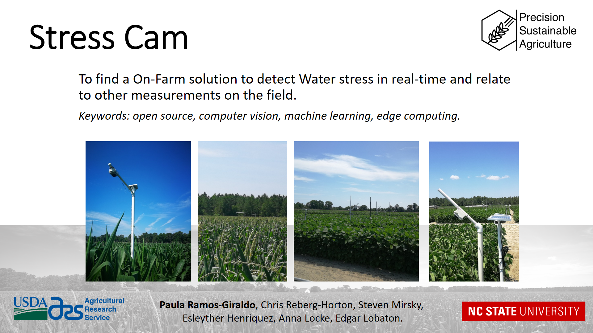
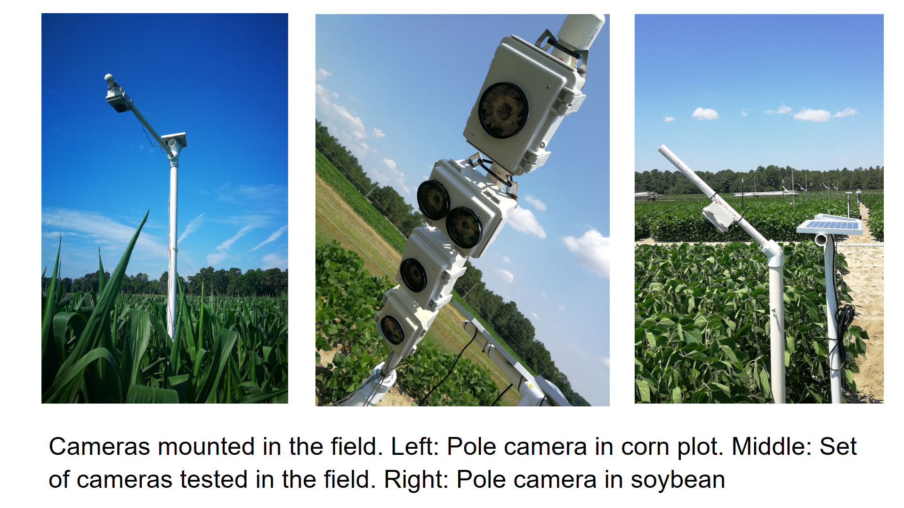
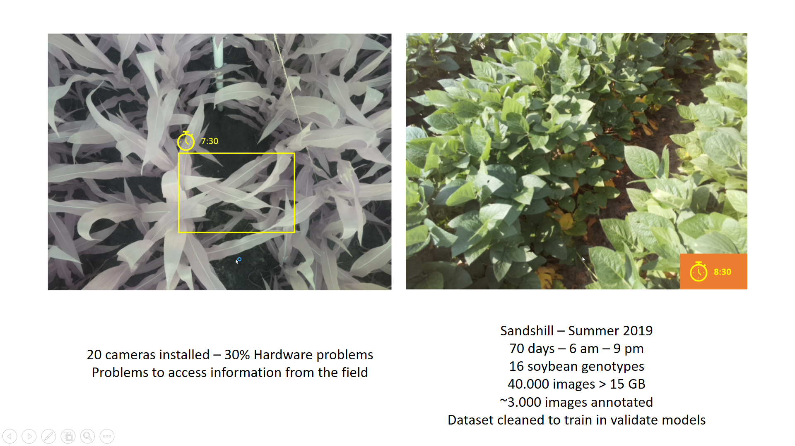
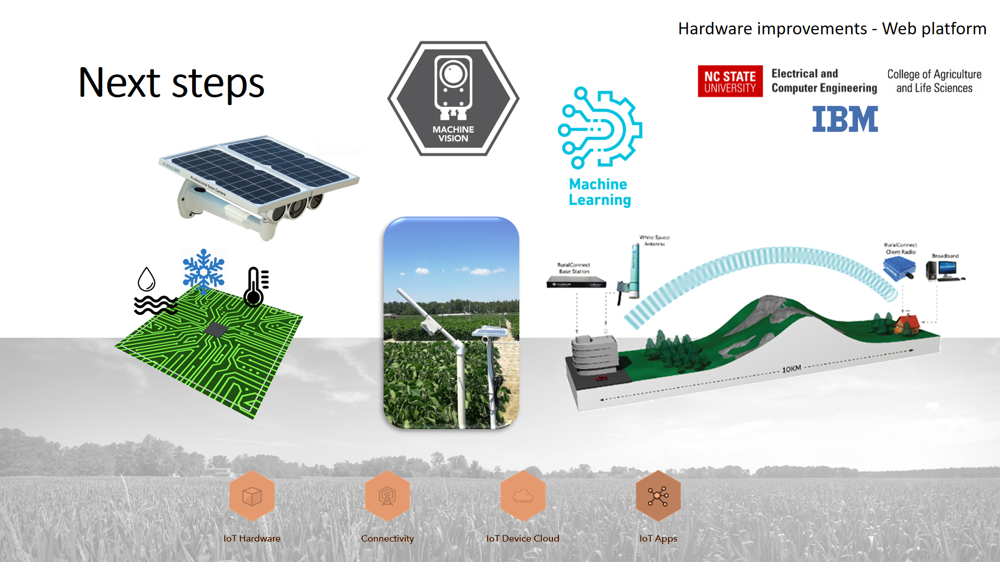

## ABOUT STRESSCAM

The StressCam is a project with this specific goal: To find a On-Farm solution to detect Water stress in real-time and relate to other measurements on the field.
Keywords: open source, computer vision, machine learning, edge computing.

La StressCam es una camara de bajo costo que puede ser instalada en campo de diversas formas. La camara consta de un raspberry pi, una PiCamera, un sistema de manejo de potencia y reloj de tiempo real, un regulador con bateria y panel solar. La idea de este projecto es obtener una camara de bajo costo (~U$100) que pueda ser instalada en campo y con la cual se pueda hacer gestion del cultivo, especificamente en el manejo de estres por agua.

La StressCam es instalada en campo para tomar imagenes sobre los cultivos de soya y maiz (por ahora). Esta configurada para tomar imagenes en lapso de tiempo cada 15 minutos para soya y 30 minutos para maiz. Adicionamente, el sistema de reloj de tiempo real permite apagar y encerder la camara durante un tiempo del dia para tomar las imagenes.

#ABOUT THIS REPOSITORY

You can find in this repository all instructions for setting up the camera and some reports about our actual results. The structure repository is as follow, some folders could be empty because we are still building this source.
•	Assembly and Settting Up Guide
•	Circuit Diagrams and Connections
•	Codes
•	Data Management (Database link and Codes)
•	Field Installation and Maintenance Guide
•	Packaging, Shipping, and Storage Guide
•	Power Requirements
•	Reports and Results
•	Specs Materials of Hardware
•	Troubleshoots

#ACTUAL RESULTS

Nosotros instalamos 10 camaras en un campo de maiz durante la primavera de 2019 y 20 camaras en un campo de soya durante el verano del mismo ano. La primera experiencia en maiz, nos permitio aprender sobre los posibles problemas criticos en el funcionamiento de la camara, como el sistema de potencia y el reloj de tiempo real. Posteriormente, con la experiencia en soya, nosotros nos dimos cuenta que el sistema puede resultar sensible a la temperatura interna de la caja que contiene el hardware. A partir de estas experiencias hemos definido un plan de trabajo para mejorar el funcionamiento de la camara y conectarla directamente en la finca. Nosotros listamos a continuacion los problemas encontrados en campo.
•	Power down.
•	Solar panel installation.
•	Water protection.
•	Heat protection.
•	Animal protection.
•	Improve connectivity and communication.

Actualmente tenemos una base de imagenes de cerca 40.000 imagenes de las cual hemos anotado cerca de 3.000 imagenes. Sin embargo, este dataset necesita mejorarse para obtener mas constancia en la informacion y en las escenas tomadas. Con relacion al procesamiento de imagenes estamos tenemos dos lineas de trabajo, en la primera se desarrollan algoritmos de vision por computador para mejorar la calidad de las imagenes tomadas en campo y disminuir el efecto de las condiciones outdoor no controladas. La segunda linea se relaciona con metodos de machine learning y deep learning para clasificar los niveles de drought presentes en las plantas.

#NEXT STEPS

#WORK TEAM

If you are interesting about to work with us please contact us. Here our work teams and roles.
•	Paula Ramos-Giraldo, PhD - Leader - NCSU Postdoc, Computer Vision and Machine Learning Scientist.
•	Chris Reberg-Horton, PhD - Leader PSA project - NCSU Full Professor.
•	Steven Mirsky, PhD - Leader PSA Project - USDA Scientist.
•	Anna Locke, PhD - Advisor - USDA Scientist.
•	Edgar Lobaton, PhD - Advisor - NCSU Associate Professor.
•	Esleyther Henriquez, Ag - Field team - NCSU Graduate Student.
•	Design ECE NCSU Course. 
•	Neural Networks ECE NCSU Course.
•	CALS NCSU Department.
