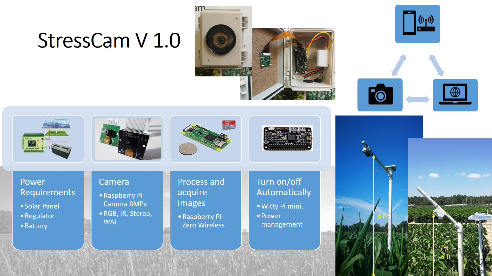
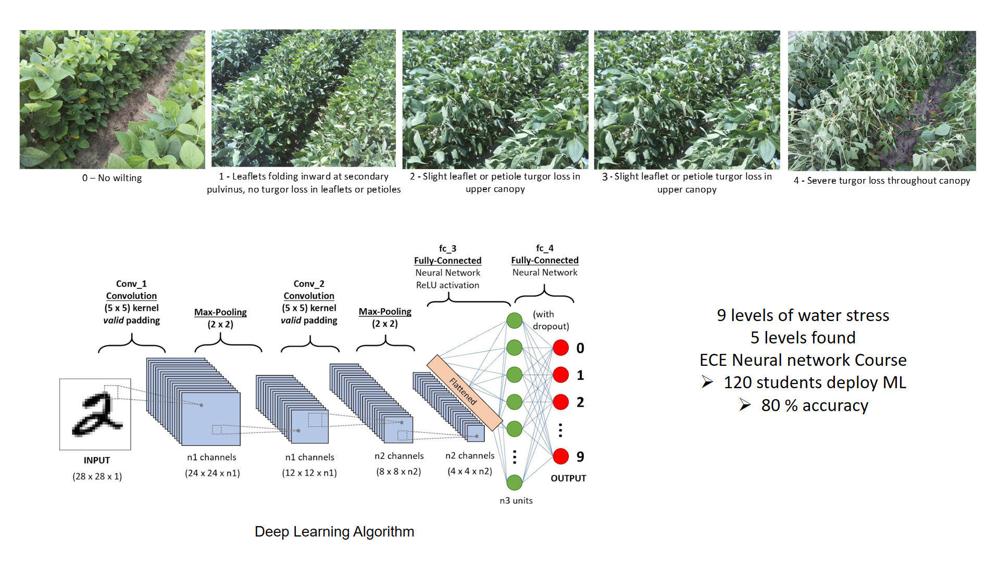

The StressCam is a project with this specific goal: To find a On-Farm solution to detect Water stress in real-time and relate to other measurements on the field. Keywords: open source, computer vision, machine learning, edge computing.

The StressCam is a low cost camera that can be installed in the field in a several ways. The camera consists of a raspberry pi, a PiCamera, a power management system and real time clock, a regulator with battery and solar panel. The idea of this project is to obtain a low cost camera (~U$100) that can be installed in the field and with which we can manage the crop, specifically in the management of water stress.

The StressCam is installed in the field to take pictures of the soybean and corn crops (for now). It is configured to take images every 15 minutes for soybean and 30 minutes for corn. In addition, the real-time clock system allows the camera to be turned off and turned on during the day to take images.

ABOUT THIS REPOSITORY

You can find in this repository all instructions for setting up the camera and some reports about our actual results. The structure repository is as follow, some folders could be empty because we are still building this source. • Assembly and Settting Up Guide • Circuit Diagrams and Connections • Codes • Data Management (Database link and Codes) • Field Installation and Maintenance Guide • Packaging, Shipping, and Storage Guide • Power Requirements • Reports and Results • Specs Materials of Hardware • Troubleshoots

ACTUAL RESULTS

We installed 10 cameras in a corn field during the spring of 2019 and 20 cameras in a soybean field during the summer of the same year. The first experience in corn, allowed us to learn about possible critical problems in the operation of the camera, such as the power system and the real time clock. Later, with the experience in soybean, we realized that the system can be sensitive to the internal temperature of the box containing the hardware. From these experiences we have defined a work plan to improve the operation of the camera and connect it directly to the farm. We list below the problems encountered in the field. • Power down. • Solar panel installation. • Water protection. • Heat protection. • Animal protection. • Improve connectivity and communication.

We currently have an image base of about 40,000 images of which we have annotated about 3,000 images. However, this dataset needs to be improved in order to obtain more constancy in the information and in the scenes taken. In relation to image processing we have two lines of work, the first develops computer vision algorithms to improve the quality of images taken in the field and lessen the effect of uncontrolled outdoor conditions. The second line relates to machine learning and deep learning methods to classify the drought levels present in the plants.

  

NEXT STEPS

WORK TEAM

If you are interesting about to work with us please contact us. Here our work teams and roles.

• Paula Ramos-Giraldo, PhD - Leader - Research Scientist, Computer Vision and Machine Learning Scientist. pramosg@ncsu.edu • Chris Reberg-Horton, PhD - PSA Director - NCSU Full Professor. screberg@ncsu.edu • Steven Mirsky, PhD - PSA Director - USDA Scientist. screberg@ncsu.edu • Artem Minin, NCSU Grad Student. aaminin@ncsu.edu • Anna Locke, PhD - Advisor - USDA Scientist. anna_locke@ncsu.edu • Edgar Lobaton, PhD - Advisor - NCSU Associate Professor. edgar.lobaton@ncsu.edu • Esleyther Henriquez, Ag - Field team - Research Assistant. elhenriq@ncsu.edu • Design ECE NCSU Course. • Neural Networks ECE NCSU Course. • CALS NCSU Department.
